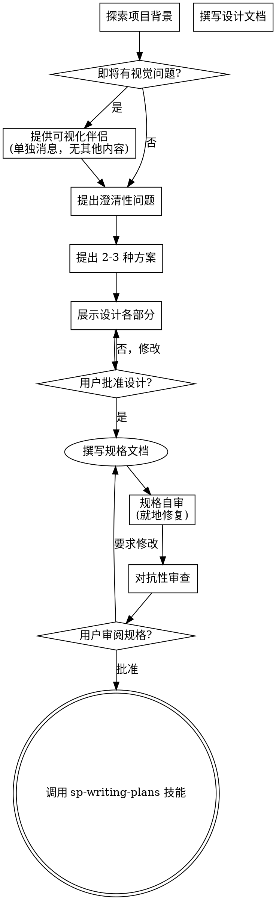

# 头脑风暴：将想法转化为设计

通过自然的协作对话，帮助将想法转化为完整的设计和规格说明。

首先了解当前项目背景，然后逐一提问来细化想法。一旦理解了要构建什么，就展示设计并获得用户批准。

<HARD-GATE>
在展示设计并获得用户批准之前，不得调用任何实现技能、编写任何代码、搭建任何项目或采取任何实现行动。无论项目看起来多简单，都适用此规则。
</HARD-GATE>

## 反模式："这太简单了，不需要设计"

每个项目都要经过这个流程。待办清单、单函数工具、配置变更——全部如此。"简单"的项目恰恰是未经审视的假设造成最多浪费的地方。设计可以很短（对于真正简单的项目只需几句话），但你必须展示它并获得批准。

## 检查清单

你必须为以下每个条目创建任务，并按顺序完成：

1. **探索项目背景** — 检查文件、文档、最近的提交
2. **提供可视化伴侣**（如果话题涉及视觉问题）— 这是单独的一条消息，不与澄清性问题合并。见下方"可视化伴侣"部分。
3. **提出澄清性问题** — 一次一个，理解目的/约束/成功标准
4. **提出 2-3 种方案** — 包含权衡分析和你的推荐
5. **展示设计** — 按各部分复杂度缩放篇幅，每部分完成后获取用户批准
6. **撰写规格文档** — 保存 .feature + -design.md 并提交
7. **规格自审** — 快速检查占位符、矛盾、歧义、范围、可测试性（见下方）
8. **对抗性审查** — 派遣子agent独立审查，循环直到无严重问题
9. **用户审阅已写规格** — 请用户在继续之前审阅规格文件
10. **过渡到实现** — 调用 sp-writing-plans 技能来创建实现计划

## 流程图



**终止状态是调用 sp-writing-plans。** 不要调用 frontend-design、mcp-builder 或任何其他实现技能。头脑风暴之后唯一调用的技能是 sp-writing-plans。

## 流程详解

**理解想法：**

- 首先检查当前项目状态（文件、文档、最近的提交）
- 在提出详细问题之前，评估范围：如果请求描述了多个独立子系统（例如"构建一个包含聊天、文件存储、计费和分析的平台"），立即标记这一点。不要花时间去细化一个需要先分解的项目的细节。
- 如果项目太大，无法用单个规格说明覆盖，帮助用户分解为子项目：有哪些独立部分，它们如何关联，应该按什么顺序构建？然后通过正常设计流程对第一个子项目进行头脑风暴。每个子项目各有其独立的 规格 → 计划 → 实现 周期。
- 对于范围适当的项目，逐一提问来细化想法
- 尽可能使用选择题，但开放式问题也可以
- 每条消息只问一个问题——如果某个话题需要更多探索，拆分为多个问题
- 聚焦于理解：目的、约束、成功标准

**探索方案：**

- 提出 2-3 种不同方案及其权衡
- 以对话方式展示选项，附上你的推荐和理由
- 以推荐选项开头，解释原因

**展示设计：**

- 一旦你认为理解了要构建什么，就展示设计
- 每部分篇幅与其复杂度匹配：如果简单直接就几句话，如果有细微差别则最多 200-300 词
- 每部分完成后询问是否正确
- 覆盖：**行为规格（BDD Scenarios）**、架构、组件、数据流、错误处理、测试
- 如果有不清楚的地方，准备好回头澄清

**段落顺序：**
1. **行为规格** — 先呈现核心 Scenarios（正常路径+异常路径），确认行为预期正确
   - ≤2 个 Feature：一次性呈现全部 Scenarios
   - \>2 个 Feature：按 Feature 分次呈现，每个 Feature 单独确认
2. 架构与组件
3. 数据流与关键接口
4. 错误处理
5. 测试策略

**为隔离性和清晰性而设计：**

- 将系统拆分为更小的单元，每个单元有一个明确的职责，通过定义良好的接口通信，可以独立理解和测试
- 对于每个单元，你应该能回答：它做什么，如何使用它，它依赖什么？
- 别人能否不看内部实现就理解一个单元做什么？你能否在不破坏消费者的情况下修改内部实现？如果不能，边界需要调整。
- 更小、边界清晰的单元也更容易处理——你能更好地推理可以一次放入上下文的代码，当文件聚焦时你的编辑更可靠。当文件变大时，通常是它承担了太多职责的信号。

**在现有代码库中工作：**

- 在提出修改建议之前先探索当前结构。遵循现有模式。
- 当现有代码存在影响工作的问题（例如文件过大、边界不清、职责纠缠），将有针对性的改进作为设计的一部分——就像一个优秀的开发者改进他正在工作的代码一样。
- 不要提议无关的重构。保持聚焦于服务当前目标。

## 产出格式

### 行为规格（`.feature` 文件）

```gherkin
Feature: [功能名称]
  [一句话描述功能目的]

  Background:
    Given [所有场景共享的前置条件]

  Scenario: [正常路径 - 场景名]
    Given [前置条件/上下文]
    And [额外条件]
    When [触发动作]
    Then [预期结果]
    And [额外断言]

  Scenario: [异常路径 - 场景名]
    Given [前置条件/上下文]
    When [触发错误动作]
    Then [预期错误处理]

  Scenario Outline: [参数化场景名]
    Given [前置条件]
    When [动作 with <param>]
    Then [预期结果 <expected>]

    Examples:
      | param   | expected        |
      | value1  | result1         |
      | value2  | result2         |
      | 边界值  | 边界结果        |
```

**规格要求：**
- 每个 Feature 至少 1 个正常路径 + 1 个异常路径 Scenario
- 有多组输入/输出时使用 Scenario Outline + Examples
- Scenario 用业务语言描述，不涉及实现细节
- 每个 Then 必须可验证（可转化为 assert）

## 设计完成后

**文档：**

- 行为规格写入 `docs/specs/YYYY-MM-DD-<topic>.feature`
- 技术方案写入 `docs/specs/YYYY-MM-DD-<topic>-design.md`
  - （用户对规格位置的偏好优先于此默认值）
- 如果可用，使用 elements-of-style:writing-clearly-and-concisely 技能
- 将设计文档提交到 git

**规格自审：**
写完规格文档后，用全新的眼光审视它：

1. **占位符扫描：** 是否有"待定"、"TODO"、不完整的部分或模糊的需求？修复它们。
2. **内部一致性：** 各部分之间是否有矛盾？架构是否与功能描述匹配？
3. **范围检查：** 这是否足够聚焦，可以用单个实现计划覆盖，还是需要分解？
4. **歧义检查：** 是否有任何需求可以被两种方式解读？如果有，选定一种并明确表述。
5. **可测试性：** 每个 BDD Scenario 的 Then 是否可直接转化为 assert？

就地修复任何问题。无需重新审阅——修复后继续。

**对抗性审查：**
派遣独立子agent，使用 `sp-adversarial-review` 作为角色指令。提供：行为规格（.feature）+ 技术方案（-design.md）。

循环规则：
- 有严重问题 → 修正后重新提交审查
- 无严重问题 → 终止迭代
- 最多 3 轮

**用户审阅关卡：**
规格审阅循环通过后，请用户在继续之前审阅已写的规格：

> "规格已撰写并提交到 `<路径>`。请审阅它，如果在我们开始编写实现计划之前您想做任何修改，请告诉我。"

等待用户的回复。如果他们要求修改，进行修改并重新运行规格审阅循环。只有用户批准后才继续。

**实现：**

- 调用 sp-writing-plans 技能来创建详细的实现计划
- 不要调用任何其他技能。sp-writing-plans 是下一步。

## 核心原则

- **一次一个问题** — 不要用多个问题压倒用户
- **优先选择题** — 在可能的情况下比开放式问题更容易回答
- **严格 YAGNI** — 从所有设计中移除不必要的功能
- **探索替代方案** — 在确定之前总是提出 2-3 种方案
- **增量验证** — 展示设计，获得批准后再继续
- **保持灵活** — 当有不清楚的地方时回头澄清

## 可视化伴侣

一个基于浏览器的伴侣工具，用于在头脑风暴期间展示原型图、图表和视觉选项。作为工具而非模式提供。接受伴侣意味着它可用于受益于视觉处理的问题；这并不意味着每个问题都通过浏览器处理。

**提供伴侣：** 当你预期即将到来的问题涉及视觉内容（原型图、布局、图表）时，征求一次同意：
> "我们正在讨论的一些内容如果能在浏览器中展示给你看可能更容易理解。我可以在讨论过程中制作原型图、图表、对比和其他视觉材料。此功能仍然较新，可能消耗较多 token。要试试吗？（需要打开本地 URL）"

**此提议必须是单独的消息。** 不要将其与澄清性问题、背景摘要或任何其他内容合并。消息应仅包含上述提议，别无其他。等待用户回复后再继续。如果他们拒绝，继续纯文本头脑风暴。

**逐问题决定：** 即使用户同意后，也要为每个问题决定使用浏览器还是终端。判断标准：**用户看到它是否比读到它更容易理解？**

- **使用浏览器** — 内容本身是视觉性的：原型图、线框图、布局对比、架构图、并排视觉设计
- **使用终端** — 内容是文本性的：需求问题、概念选择、权衡列表、A/B/C/D 文本选项、范围决策

关于 UI 话题的问题不一定是视觉问题。"在这个上下文中'个性'是什么意思？"是概念问题——用终端。"哪种向导布局更好？"是视觉问题——用浏览器。

如果他们同意伴侣，在继续之前阅读详细指南：
`skills/brainstorming/visual-companion.md`
